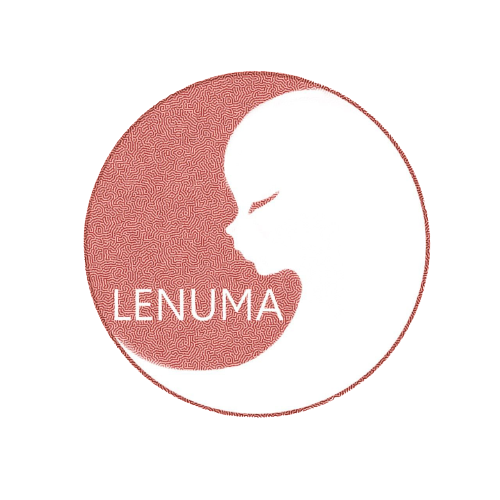

  </img>
   
  <h1 align="center">Lenuma</h1>
  
At Lenuma, we are dedicated to developing software that empowers users to achieve their goals efficiently and effectively 

 

### Lenuma Projects
- [Sonya Voice Assistant](https://github.com/Lenuma-inc/SonyaPy) - Sonya is a Russian voice assistant for offline work.
- [LunaOS](https://github.com/Lenuma-inc/LunaOS-ISO) - LunaOS is our flagship Linux distribution designed to elevate your computing experience. With a focus on versatility, performance, and user-friendliness, LunaOS is the ultimate choice for both professional tasks and gaming enthusiasts.
